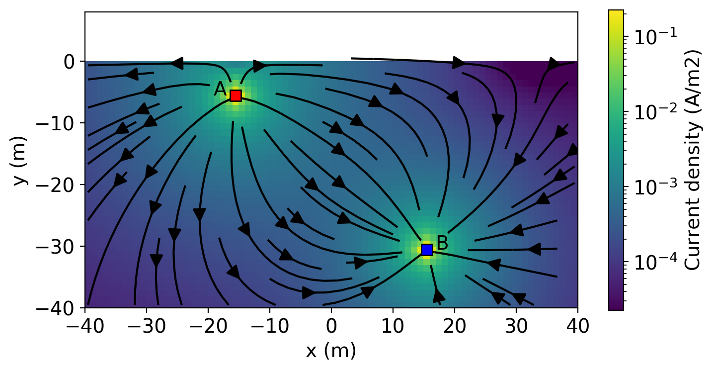

**[summary](#summary) | [contents](#contents) | [usage](#usage) | [running the notebooks](#running-the-notebooks) | [issues](#issues) | [citation](#citation) | [license](#license)**

# groundwater-book-figures

[](https://travis-ci.org/simpeg-research/groundwater-book-figures)
[](https://mybinder.org/v2/gh/simpeg-research/groundwater-book-figures/master?filepath=index.ipynb)
[](https://github.com/simpeg-research/groundwater-book-figures/blob/master/LICENSE)
[](http://simpeg.xyz)




## Summary

Here we run 2D DC resistivity simulations to generate images of the currents, sensitivity and model resolution matrix. 

## Contents

There is 1 notebook in this repository:

- [DC_currents.ipynb](/notebooks/DC_currents.ipynb) : runs DC surface and borehole surveys and generates figures of the currents, and sensitivities

## Usage

To run the notebooks locally, you will need to have python installed,
preferably through [anaconda](https://www.anaconda.com/download/) .

You can then clone this repository. From a command line, run

```
git clone https://github.com/simpeg-research/groundwater-book-figures.git
```

Then `cd` into the `groundwater-book-figures` directory:

```
cd groundwater-book-figures
```

To setup your software environment, we recommend you use the provided conda environment

```
conda env create -f environment.yml
conda activate groundwater-book
```

You can then launch Jupyter

```
jupyter notebook
```

Jupyter will then launch in your web-browser.

## Running the notebooks

Each cell of code can be run with `shift + enter` or you can run the entire notebook by selecting `cell`, `Run All` in the toolbar.


For more information on running Jupyter notebooks, see the [Jupyter Documentation](https://jupyter.readthedocs.io/en/latest/)

## Issues

Please [make an issue](https://github.com/simpeg-research/groundwater-book-figures/issues) if you encounter any problems while trying to run the notebooks.

## Citation

If you build upon or use these examples in your work, please cite:

Cockett, R., Kang, S., Heagy, L. J., Pidlisecky, A., & Oldenburg, D. W. (2015). SimPEG: An open source framework for simulation and gradient based parameter estimation in geophysical applications. Computers & Geosciences, 85, 142-154.

```
@article{cockett2015simpeg,
  title={SimPEG: An open source framework for simulation and gradient based parameter estimation in geophysical applications},
  author={Cockett, Rowan and Kang, Seogi and Heagy, Lindsey J and Pidlisecky, Adam and Oldenburg, Douglas W},
  journal={Computers \& Geosciences},
  volume={85},
  pages={142--154},
  year={2015},
  publisher={Elsevier}
}
```

Heagy, L. J., Cockett, R., Kang, S., Rosenkjaer, G. K., & Oldenburg, D. W. (2017). A framework for simulation and inversion in electromagnetics. Computers & Geosciences, 107, 1-19.

```
@article{heagy2017framework,
  title={A framework for simulation and inversion in electromagnetics},
  author={Heagy, Lindsey J and Cockett, Rowan and Kang, Seogi and Rosenkjaer, Gudni K and Oldenburg, Douglas W},
  journal={Computers \& Geosciences},
  volume={107},
  pages={1--19},
  year={2017},
  publisher={Elsevier}
}
```


## License
These notebooks are licensed under the [BSD-3 License](/LICENSE) which allows academic and commercial re-use and adaptation of this work.
